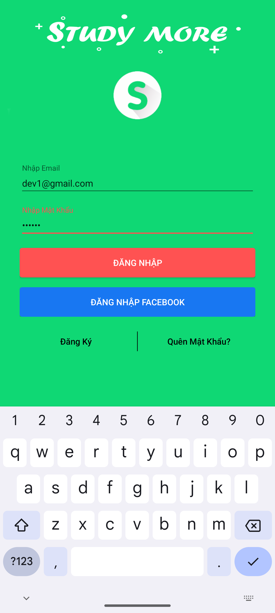
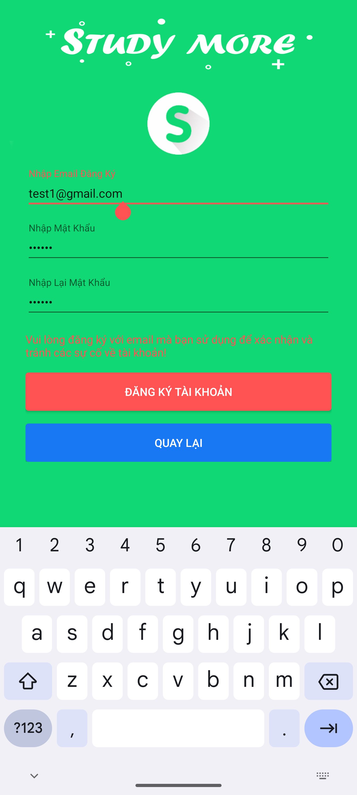
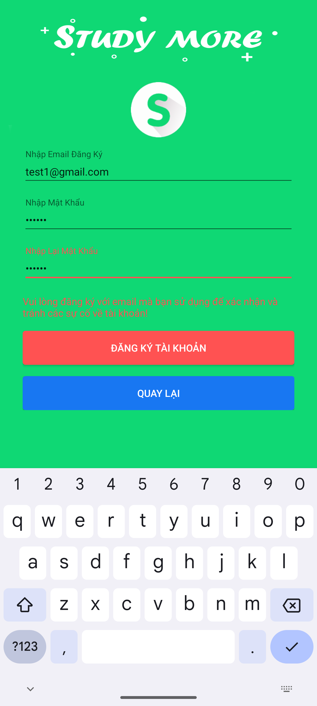
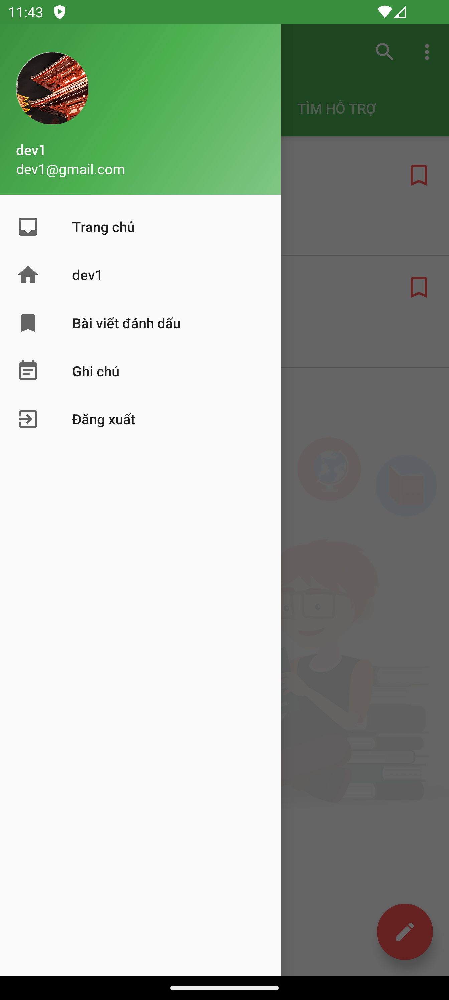
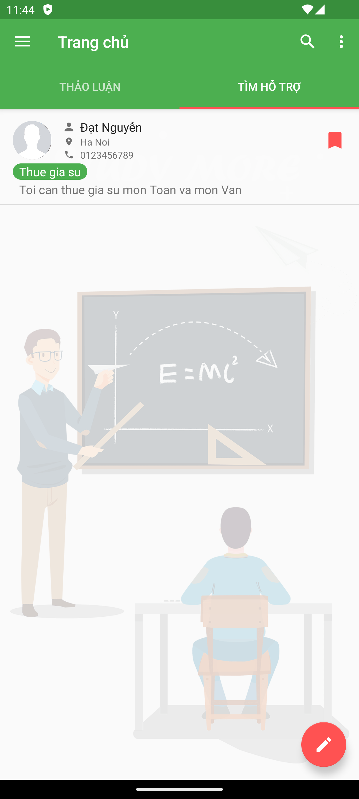

## 💝 Ủng hộ tôi

### Nếu bạn thấy dự án của tôi hữu ích và muốn ủng hộ tôi, hãy quét mã QR bên dưới:

|                                                                              |  |  |  |
|-------------------------------------------------------------------------------------------------------------------------------|-----------------------------------|---------------------------------------------------|-----------------------------------|
| **Momo:&nbsp;&nbsp;&nbsp;&nbsp;&nbsp;&nbsp;&nbsp;&nbsp;&nbsp;&nbsp;&nbsp;&nbsp;&nbsp;&nbsp; 0981054498 - NGUYEN ANH DAT** | **Thank you 🙌**                  | **Techcombank: 1981054498 - NGUYEN ANH DAT**  | **Thank you 🙌**                  |

### Cảm ơn sự hào phóng của bạn! 🙌

---

## Giới thiệu ứng dụng StudyMore

### Mô tả

- Ứng dụng **StudyMore** là một bài tập lớn của tôi tại Viện CNTT T3H, ngôn ngữ lập trình là `Android - Java`. Tôi code cơ bản và dễ hiểu, phù hợp với ai mới học. Tôi cũng đã cập nhật, bạn chỉ cần tải về và chạy. Bạn có thể dùng **StudyMore** như một tài liệu tham khảo hoặc dùng làm bài tập của mình.
- Ứng dụng **StudyMore** có các tính năng cơ bản của một mạng xã hội, người dùng có thể đăng bài, tạo ghi chú, đánh dấu bài viết.
- Ứng dụng **StudyMore** sử dụng `Firebase` để làm backend. Bạn có thể dùng luôn dự án `Firebase` của tôi hoặc tạo 1 dự án của riêng mình, chỉ cần chạy **StudyMore** các cấu trúc trong database sẽ tự động được tạo.

### Chạy thử

- Tài khoản: **dev1@gmail.com**
- Mật khẩu: **123456**

#### Màn hình

|  |   |  |  | 
|----------------------------------|-----------------------------------|----------------------------------|----------------------------------|
|  |   |  |  |

#### Firebase

https://github.com/user-attachments/assets/02f52e75-b5f1-497b-ae2e-4b3a34a88618

